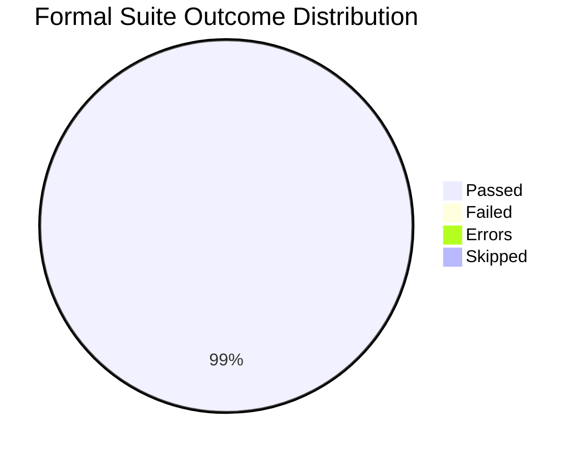
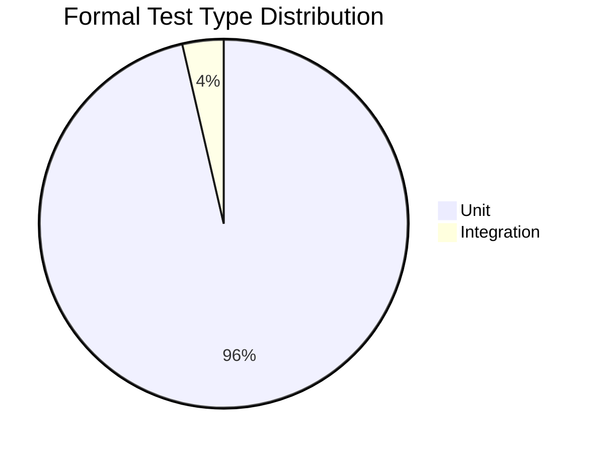
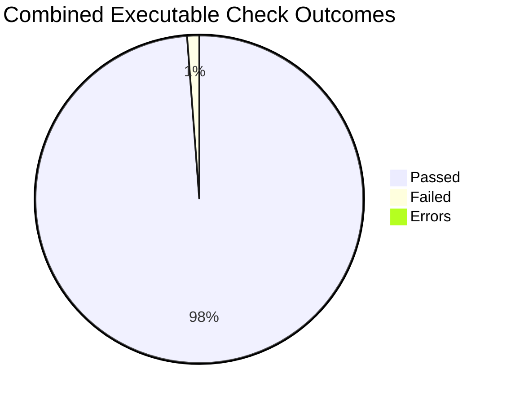

# AutoReturn Full Test Statistics And Evaluation

Date: 2026-04-28

This report is the corrected full-suite test evaluation. The earlier report covered only the affected tests run during recent voice/UI/cache changes. This version includes full test discovery across `testing_formal/` and `tests/`.

## Test Discovery

| Location | Discovered Files | Execution Method | Status |
|---|---:|---|---|
| `testing_formal/tests/` | 26 | `unittest discover` | Executed |
| `tests/test_event_extractor.py` | 1 | Direct script run | Executed |
| `tests/test_ollama.py` | 1 | Direct script run | Executed, environment failed |
| `tests/test_tone_selector.py` | 1 | Manual Qt script | Not automated |
| Total discovered test files | 29 | Mixed | 28 checked, 1 manual |

## Commands Used

Full formal suite:

```bash
/usr/bin/time -p .venv/bin/python -m unittest discover -s testing_formal/tests -p 'test*.py'
```

Per-file formal statistics:

```bash
.venv/bin/python -c "<per-file unittest runner>"
```

Legacy script checks:

```bash
env PYTHONPATH=. /usr/bin/time -p .venv/bin/python tests/test_event_extractor.py
env PYTHONPATH=. perl -e 'alarm 25; exec @ARGV' .venv/bin/python tests/test_ollama.py
```

Pytest availability check:

```bash
.venv/bin/python -m pytest -q tests
```

Result: `pytest` is not installed in the active `.venv`, so the legacy `tests/` folder cannot currently be run through pytest.

## Formal Suite Summary

| Metric | Result |
|---|---:|
| Formal test files executed | 26 |
| Formal test cases executed | 166 |
| Passed | 164 |
| Failed | 1 |
| Errors | 1 |
| Skipped | 0 |
| Pass rate | 98.80% |
| Failure rate | 0.60% |
| Error rate | 0.60% |
| Formal unittest runtime | 5.430s |
| Formal wall-clock runtime | 13.18s |



```text
Formal Suite Outcome

Passed  | #################################################################################################### 164
Failed  | # 1
Errors  | # 1
Skipped |  0
```

## Formal Results By File

| Test File | Tests | Passed | Failed | Errors | Skipped | Time |
|---|---:|---:|---:|---:|---:|---:|
| `testing_formal/tests/integration/test_agents_fetch_integration_formal.py` | 4 | 4 | 0 | 0 | 0 | 0.015s |
| `testing_formal/tests/integration/test_summary_queue_integration.py` | 2 | 1 | 1 | 0 | 0 | 0.003s |
| `testing_formal/tests/unit/test_agents_orchestrator_formal.py` | 6 | 6 | 0 | 0 | 0 | 0.011s |
| `testing_formal/tests/unit/test_ai_service_formal.py` | 5 | 5 | 0 | 0 | 0 | 0.003s |
| `testing_formal/tests/unit/test_attachment_resolver_formal.py` | 4 | 4 | 0 | 0 | 0 | 0.006s |
| `testing_formal/tests/unit/test_autoreturn_app_utils_formal.py` | 22 | 22 | 0 | 0 | 0 | 0.009s |
| `testing_formal/tests/unit/test_calendar_service_formal.py` | 6 | 6 | 0 | 0 | 0 | 0.151s |
| `testing_formal/tests/unit/test_desktop_notifications_formal.py` | 3 | 3 | 0 | 0 | 0 | 0.003s |
| `testing_formal/tests/unit/test_draft_manager_formal.py` | 6 | 6 | 0 | 0 | 0 | 0.011s |
| `testing_formal/tests/unit/test_event_extractor_formal.py` | 4 | 4 | 0 | 0 | 0 | 0.605s |
| `testing_formal/tests/unit/test_frontend_dialogs_widgets_formal.py` | 10 | 9 | 0 | 1 | 0 | 0.783s |
| `testing_formal/tests/unit/test_gmail_automation_core_formal.py` | 6 | 6 | 0 | 0 | 0 | 0.008s |
| `testing_formal/tests/unit/test_gmail_backend_formal.py` | 6 | 6 | 0 | 0 | 0 | 0.005s |
| `testing_formal/tests/unit/test_message_analysis_cache_formal.py` | 3 | 3 | 0 | 0 | 0 | 0.000s |
| `testing_formal/tests/unit/test_models_formal.py` | 8 | 8 | 0 | 0 | 0 | 0.001s |
| `testing_formal/tests/unit/test_orchestrator_init_formal.py` | 1 | 1 | 0 | 0 | 0 | 0.001s |
| `testing_formal/tests/unit/test_policy_and_settings_formal.py` | 8 | 8 | 0 | 0 | 0 | 0.004s |
| `testing_formal/tests/unit/test_priority_engine_formal.py` | 5 | 5 | 0 | 0 | 0 | 1.823s |
| `testing_formal/tests/unit/test_project_wide_static_formal.py` | 2 | 2 | 0 | 0 | 0 | 1.188s |
| `testing_formal/tests/unit/test_settings_and_main_formal.py` | 3 | 3 | 0 | 0 | 0 | 0.135s |
| `testing_formal/tests/unit/test_slack_backend_formal.py` | 5 | 5 | 0 | 0 | 0 | 0.001s |
| `testing_formal/tests/unit/test_timezone_utils_formal.py` | 3 | 3 | 0 | 0 | 0 | 0.111s |
| `testing_formal/tests/unit/test_tone_detector_formal.py` | 1 | 1 | 0 | 0 | 0 | 0.003s |
| `testing_formal/tests/unit/test_tone_engine_formal.py` | 4 | 4 | 0 | 0 | 0 | 0.011s |
| `testing_formal/tests/unit/test_tone_service_formal.py` | 6 | 6 | 0 | 0 | 0 | 0.040s |
| `testing_formal/tests/unit/test_voice_service_formal.py` | 33 | 33 | 0 | 0 | 0 | 0.032s |
| **Total** | **166** | **164** | **1** | **1** | **0** | **4.960s** |

## Test Distribution By Area

| Area | Tests | Passed | Failed | Errors | Share |
|---|---:|---:|---:|---:|---:|
| Unit tests | 160 | 159 | 0 | 1 | 96.4% |
| Integration tests | 6 | 5 | 1 | 0 | 3.6% |
| Total formal tests | 166 | 164 | 1 | 1 | 100.0% |



```text
Formal Test Type Split

Unit tests        | ################################################################################################ 160
Integration tests | ###### 6
```

## Failing Formal Checks

| Test | Type | Result | Issue |
|---|---|---|---|
| `TestSummaryQueueIntegration.test_add_to_queue_accepts_only_unsummarized_messages` | Integration | Failure | Expected queue length `2`, actual queue length `1`. Current `QueueSummaryGenerator.add_to_queue()` rejects messages without `full_content`, `content_preview`, or `preview`, while the test fixture message has no content field. |
| `TestFrontendDialogsWidgetsFormal.test_tone_selector_auto_suggest` | Unit | Error | `ToneSelector.populate_tones()` accesses `orchestrator.tone_engine.user_profile.default_tone`; the fake test tone engine does not define `user_profile`, causing `AttributeError`. |

## Legacy Script Checks

| Script | Executed | Result | Notes |
|---|---:|---|---|
| `tests/test_event_extractor.py` | Yes | Pass | Ran with `PYTHONPATH=.`. Output: `Test 1 events: 1`, `Test 2 events: 1`. |
| `tests/test_ollama.py` | Yes | Environment failure | Ollama was not running or was not accessible at test time. |
| `tests/test_tone_selector.py` | No | Manual only | This opens an interactive Qt window and blocks on `app.exec()`, so it is not an automated CI-style test. |

## Combined Executable Check Summary

This combines formal unittest cases plus the two executable legacy scripts. The manual tone selector script is excluded from executed totals.

| Metric | Result |
|---|---:|
| Executed formal test cases | 166 |
| Executed legacy scripts | 2 |
| Total executable checks | 168 |
| Passed checks | 165 |
| Failed checks | 2 |
| Error checks | 1 |
| Manual/not automated | 1 |
| Combined executable pass rate | 98.21% |



## Evaluation Measures

| Evaluation Measure | Formula | Formal Suite Result | Combined Executable Result |
|---|---|---:|---:|
| Pass Rate | `(Passed / Total Executed) * 100` | 98.80% | 98.21% |
| Failure Rate | `(Failures / Total Executed) * 100` | 0.60% | 1.19% |
| Error Rate | `(Errors / Total Executed) * 100` | 0.60% | 0.60% |
| Skip Rate | `(Skipped / Total Executed) * 100` | 0.00% | 0.00% |
| Formal Unit Share | `(Unit Tests / Formal Tests) * 100` | 96.4% | N/A |
| Formal Integration Share | `(Integration Tests / Formal Tests) * 100` | 3.6% | N/A |
| Regression Status | `Failures == 0 and Errors == 0` | Fail | Fail |
| Environment Dependency Status | Live external checks available | N/A | Ollama unavailable |

## Functional Coverage In The Formal Suite

| Feature Area | What Is Covered |
|---|---|
| Agents and orchestrator | Agent request handling, intent routing, orchestrator initialization. |
| Gmail and Slack backends | Mocked backend fetch/connection behavior and integration fetch flows. |
| AI service | Ollama service request handling, summary queue behavior, text/summary error handling. |
| Voice feature | Command parsing, natural intent parsing, macOS isolated audio/transcription path, wake-word flow, recorder/transcriber lifecycle. |
| UI utilities | Filtering, sorting, pagination, voice UI actions, direct-send safety checks, contact lookup. |
| Dialogs and widgets | Auth dialog, reply dialogs, notification dialog, event review dialog, tone display, tone selector. |
| Priority engine | Urgency scoring, dataset loading, sender priority rules, semantic model fallback path. |
| Tone engine/service | Tone detection, user preference updates, tone adjustment/recommendation error handling. |
| Event extraction and calendar | Relative event extraction, birthday extraction, task context, ICS/calendar service behavior. |
| Settings and policy | Automation settings, reply policy, main/settings initialization. |
| Static checks | Project-wide import/syntax-oriented static tests. |

## Limitations

| Limitation | Impact |
|---|---|
| `pytest` is not installed in the active `.venv`. | The legacy `tests/` folder cannot be run through pytest without installing `testing_formal/requirements-test.txt`. |
| `tests/test_ollama.py` depends on a live Ollama server and local model. | It failed because Ollama was unavailable, not necessarily because the code is broken. |
| `tests/test_tone_selector.py` is interactive. | It is not suitable for automated pass/fail execution without refactoring. |
| Formal Gmail/Slack integration tests use fake backends. | They validate application logic but not real OAuth/network behavior. |
| Live microphone and Whisper quality are not fully tested. | The macOS crash-isolation path is unit-tested, but real repeated voice recording is still a manual/system test. |

## Final Evaluation

The full formal suite does **not** currently pass.

```text
Formal suite:
Executed: 166
Passed:   164
Failed:   1
Errors:   1
Skipped:  0
Result:   FAIL
```

```text
Combined executable checks:
Executed: 168
Passed:   165
Failed:   2
Errors:   1
Manual:   1
Result:   FAIL
```

The previously reported 62/62 result was only for the affected subset. The corrected full evaluation shows that most of the project is passing, but there are two formal-suite issues to fix and one live Ollama script blocked by local environment availability.
